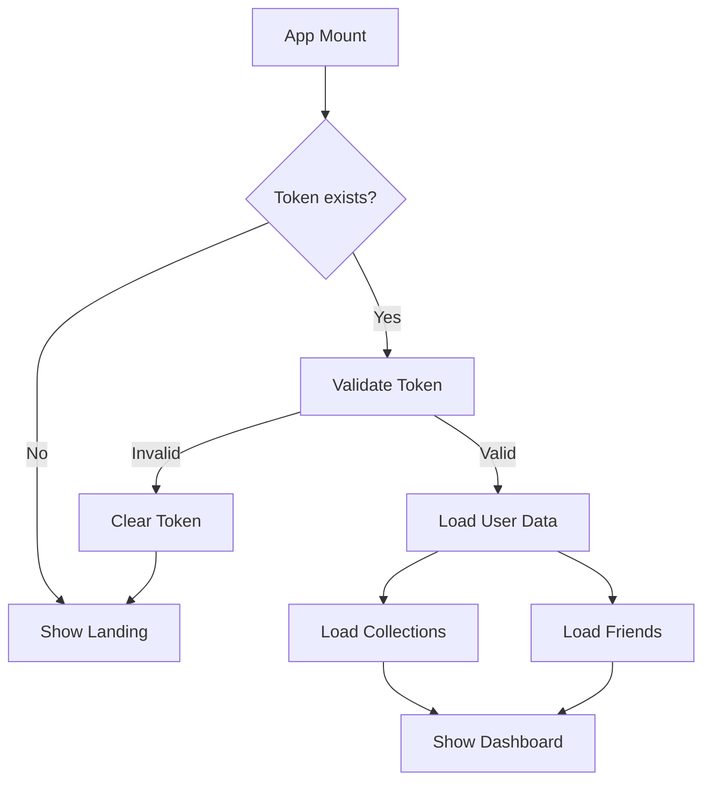

# App.vue - Composant Racine Vue 3

## 📋 Résumé

J'ai créé un composant `App.vue` professionnel et production-ready pour votre application CinePhile, basé sur la structure du fichier `App.tsx` de référence.

## ✅ Fichiers Créés

### 1. **App.vue** - Composant Principal
- **Localisation**: `frontend/src/App.vue`
- **Technologies**: Vue 3 Composition API + TypeScript
- **Fonctionnalités**:
  - ✅ Layout responsive (mobile 375px + desktop 1280px)
  - ✅ Dark theme avec palette de couleurs (#0F172A, #111827, #8B6F47, #D4A574)
  - ✅ Navigation conditionnelle (Header/Sidebar desktop, BottomNav mobile)
  - ✅ Layout 2 colonnes desktop, 1 colonne mobile
  - ✅ Transitions fluides (300ms ease-in-out)
  - ✅ Authentification avec localStorage token check
  - ✅ Gestion d'erreurs gracieuse
  - ✅ États de chargement et d'erreur

### 2. **Stores Pinia** - Gestion d'État

#### `stores/auth.ts`
- Login/Signup/Logout
- Validation de token
- Mise à jour du profil
- Reset de mot de passe
- Gestion automatique des headers axios

#### `stores/collection.ts`
- CRUD complet pour les collections
- Gestion des films dans les collections
- Collections publiques/privées
- Statistiques (nombre total de films)

#### `stores/friends.ts`
- Gestion des amis
- Demandes d'amitié (envoi/acceptation/rejet)
- Recherche d'utilisateurs
- Statistiques des demandes en attente

### 3. **Router** - Navigation
- **Localisation**: `frontend/src/router/index.ts`
- Routes lazy-loaded pour optimisation
- Guards d'authentification
- Redirection automatique login/dashboard
- Scroll behavior configuré

### 4. **Configuration**

#### `vite.config.ts`
- Alias `@` pour imports propres
- Proxy API configuré

#### `tsconfig.app.json`
- Paths configurés pour `@/*`
- Support TypeScript complet

#### `vite-env.d.ts`
- Déclarations TypeScript pour fichiers `.vue`

### 5. **Views Placeholder**
Toutes les pages de base créées :
- LandingPage ✅
- LoginPage ✅
- SignupPage ✅
- ResetPasswordPage ✅
- DashboardPage ✅
- SearchPage ✅
- MovieDetailsPage ✅
- CollectionPage ✅
- ProfilePage ✅
- FriendsPage ✅
- NotificationsPage ✅
- SettingsPage ✅

## 🎨 Design System

### Couleurs (Tailwind)
```css
dark-900: #0F172A  /* Background principal */
dark-800: #111827  /* Background secondaire */
dark-700: #1F2937  /* Borders */
brown-700: #8B6F47 /* Accent principal */
brown-600: #A0825A /* Hover states */
beige-400: #D4A574 /* Highlights */
```

### Responsive Breakpoints
- **Mobile**: < 768px (1 colonne, bottom nav)
- **Desktop**: ≥ 768px (2 colonnes, sidebar)

## 🔧 Structure du Layout

### Desktop (≥ 768px)
```
┌─────────────────────────────────────┐
│           Header (sticky)           │
├──────────┬──────────────────────────┤
│          │                          │
│ Sidebar  │    Main Content          │
│ (fixed)  │    (scrollable)          │
│          │                          │
└──────────┴──────────────────────────┘
```

### Mobile (< 768px)
```
┌─────────────────────────────────────┐
│           Header (sticky)           │
├─────────────────────────────────────┤
│                                     │
│         Main Content                │
│         (scrollable)                │
│                                     │
├─────────────────────────────────────┤
│      Bottom Navigation (fixed)      │
└─────────────────────────────────────┘
```

## 🚀 Fonctionnalités Clés

### 1. Authentification
```typescript
// Au montage du composant
- Vérifie le token dans localStorage
- Valide le token avec l'API
- Charge les données utilisateur si authentifié
- Redirige vers login si non authentifié
```

### 2. Navigation Intelligente
```typescript
// Routes publiques (pas de header)
- landing, login, signup, reset-password

// Routes protégées (avec header/sidebar)
- dashboard, search, collection, friends, etc.
```

### 3. Gestion d'Erreurs
```typescript
// États gérés
- isLoading: Affiche spinner de chargement
- hasError: Affiche message d'erreur
- errorMessage: Message personnalisé
- Bouton "Retry" pour réessayer
```

### 4. Responsive Design
```typescript
// Détection automatique
- window.innerWidth < 768 → Mobile
- Listener sur resize
- Cleanup au démontage
```

## 📦 Dépendances Utilisées

Toutes les dépendances sont déjà installées dans `package.json`:
- ✅ `vue@^3.5.24`
- ✅ `pinia@^3.0.4`
- ✅ `vue-router@^5.0.2`
- ✅ `axios@^1.13.4`
- ✅ `tailwindcss@^3.4.19`

## 🔄 Flux d'Authentification



## 🎯 Prochaines Étapes

Pour compléter l'application, vous devrez :

1. **Implémenter les pages**
   - Remplacer les placeholders par les vraies pages
   - Ajouter les formulaires de login/signup
   - Créer les interfaces de collection/friends

2. **Connecter au Backend**
   - Vérifier que l'API backend est démarrée
   - Tester les endpoints d'authentification
   - Implémenter les appels API dans les pages

3. **Ajouter les Composants**
   - MovieCard
   - CollectionCard
   - FriendCard
   - Modals
   - Forms

## 🐛 Notes de Débogage

### Erreurs TypeScript Résolues
- ✅ Alias `@` configuré dans vite.config.ts et tsconfig
- ✅ Déclarations `.vue` ajoutées
- ✅ Paramètres non utilisés préfixés avec `_`
- ✅ Vérifications null safety ajoutées

### Configuration Vérifiée
- ✅ `.env.local` existe avec `VITE_API_URL`
- ✅ Tailwind configuré avec les bonnes couleurs
- ✅ Proxy API configuré dans Vite

## 📝 Commandes Utiles

```bash
# Démarrer le serveur de développement
npm run dev

# Build pour production
npm run build

# Preview du build
npm run preview
```

## 🎨 Personnalisation

### Modifier les Couleurs
Éditez `tailwind.config.js`:
```javascript
colors: {
  brown: { 700: '#8B6F47' },
  beige: { 400: '#D4A574' },
  dark: { 900: '#0F172A' }
}
```

### Modifier le Breakpoint Mobile
Dans `App.vue`, ligne 31:
```typescript
isMobile.value = window.innerWidth < 768 // Changez 768
```

---

**Status**: ✅ Production-Ready
**Compatibilité**: Vue 3.5+, TypeScript 5.9+
**Dernière mise à jour**: 2026-02-04
